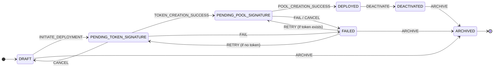

# Backend Server

This is the backend server for Clones. It handles database operations and API endpoints through a Docker container.

## Development

The backend runs in a Docker container. Use docker-compose to manage the service:

```bash
# Start the services
docker-compose up -d

# View logs
docker-compose logs -f backend

# Execute commands in container
docker exec backend npm run <command>

# Stop services
docker-compose down

```

### Creating Development Tokens

To test features involving SPL tokens, you may need to create your own development tokens on the Solana devnet. This guide explains how to create and mint tokens for use in your local development environment.

**1. Prerequisites**

Ensure you have the [Solana CLI tool suite](https://docs.solana.com/cli/install-solana-cli-tools) installed. You will specifically need `solana` and `spl-token`.

**2. Configure Solana CLI**

First, make sure your CLI is configured to point to the devnet and uses the project's local keypair.

```bash
# Set the RPC URL to devnet
solana config set --url https://api.devnet.solana.com

# Set the keypair to the one included in this repository
solana config set --keypair secrets/solana-keypair.json
```

**3. Fund Your Wallet**

You'll need some devnet SOL to pay for transaction fees.

```bash
# Airdrop 2 SOL to your wallet
solana airdrop 2
```

**4. Create a New Token**

Run the following command to create a new SPL token. A standard token has 6 decimal places.

```bash
spl-token create-token --decimals 6
```

This command will output a **Token Address** (also called a "mint address"). **Copy this address.**

Example output:
```
Creating token 4fmd25KposhGSi3hFSJP4tWWex2wGWjEQdu14YWTddFV ...
Address: 4fmd25KposhGSi3hFSJP4tWWex2wGWjEQdu14YWTddFV
```

**5. Create a Token Account**

Next, create an account in your wallet to hold the new tokens. Use the token address from the previous step.

```bash
# Replace <TOKEN_ADDRESS> with the address you copied
spl-token create-account <TOKEN_ADDRESS>
```

**6. Mint Tokens**

Now you can mint (create) as many tokens as you need for testing.

```bash
# Replace <TOKEN_ADDRESS> with your token address and <AMOUNT> with the quantity you want
spl-token mint <TOKEN_ADDRESS> <AMOUNT>
```

**7. Update Backend Configuration**

To make the backend aware of your new token, you must add its mint address to `src/services/blockchain/tokens.ts`. Find the correct token symbol (e.g., `USDC`, `CLONES`) and update the `development` address.

**8. Add to Phantom Wallet (Optional)**

You can add the token to your Phantom wallet to see your balance.
1.  Open Phantom and click "Manage Token List".
2.  Paste the **Token Address** into the search field.
3.  Enable the token.

> **Note:** The token will likely appear as "Unknown Token". This is normal because we have not provided on-chain metadata (like a name or symbol). This does not affect its functionality for development purposes.

---

## Security

### Critical: Private Key Encryption

To protect user funds, all `depositPrivateKey` values for training pools are encrypted before being stored in the database. This is a critical security measure to prevent fund theft in the event of a database breach.

The encryption is handled by the `src/services/security/crypto.ts` module, which uses the **AES-256-GCM** algorithm.

### Environment Variable Setup

The entire security mechanism relies on two critical environment variables:
- `DEPOSIT_KEY_ENCRYPTION_SECRET`: The Master Encryption Key.
- `DEPOSIT_KEY_ENCRYPTION_SALT`: A cryptographic salt used to derive the encryption key from the master key.

**Never commit these values to version control.**

#### Local Development

For local development, add the secrets to your `.env` file. You can generate secure values using:
```bash
# For the secret key
openssl rand -base64 32

# For the salt
openssl rand -base64 16
```

#### Production (Fly.io)

For production environments, set both secrets using the Fly.io CLI:
```bash
fly secrets set DEPOSIT_KEY_ENCRYPTION_SECRET="your-generated-key-here" DEPOSIT_KEY_ENCRYPTION_SALT="your-generated-salt-here" --app <your-app-name>
```

### WebSocket and Redis Configuration

For real-time updates in a multi-instance environment, the backend uses Redis. You need to provide the Redis connection URL via an environment variable.

-   `REDIS_URL`: The full connection string for your Redis server.
    -   **Local Development**: `REDIS_URL="redis://127.0.0.1:6379"`
    -   **Production (Fly.io)**: Fly.io provides a `FLY_REDIS_CACHE_URL` that you can use. Set it with `fly secrets set REDIS_URL=$FLY_REDIS_CACHE_URL`.

### Automatic Key Migration (Lazy Migration)

The system is designed to handle key rotations and legacy unencrypted keys with zero downtime through a process called **lazy migration**.

When a transaction is processed, the system automatically checks the status of the `depositPrivateKey`:
1.  **Legacy Key Detected**: If an unencrypted legacy key is found, it is immediately encrypted with the latest security key version (`v1`) and saved back to the database before the transaction proceeds.
2.  **Outdated Key Version**: In the future, if a key is encrypted with an older key version (e.g., `v1` when `v2` is the latest), the system will decrypt it using the corresponding old key and re-encrypt it with the new (`v2`) key.

This ensures that all keys are progressively updated to the latest security standard without requiring manual intervention or a dedicated maintenance window.


**Step 1: Generate and Add New Key**

Generate a new secure key. Add it to your environment secrets with a version suffix. For example, if you are rotating to version 2:

```bash
fly secrets set DEPOSIT_KEY_ENCRYPTION_SECRET_V2="your-new-key-here" --app <your-app-name>
```

**Step 2: Update the Crypto Service**

Modify `src/services/security/crypto.ts`:
1.  Uncomment the `_V2` key-loading logic and add your new secret to the `ENCRYPTION_KEYS` map with the `'v2'` key.
2.  Update the `LATEST_KEY_VERSION` constant to the new version (e.g., `export const LATEST_KEY_VERSION = 'v2'`).

**Step 3: Deploy and Monitor**

Deploy the updated application. The system will now:
- Encrypt all **new** data with the `v2` key.
- Decrypt data encrypted with both `v1` and `v2` keys.
- Automatically upgrade `v1` keys to `v2` during payment processing.
- You should monitor logs for any decryption errors.

---

## Agent Lifecycle State Machine

To ensure robust and predictable behavior, the entire lifecycle of an AI Agent—from creation to deployment and archival—is managed by a formal state machine implemented with **XState v5**. This machine serves as the **single source of truth** for all agent status transitions, eliminating the risk of inconsistent states.

### Lifecycle Diagram

The following diagram illustrates all possible agent statuses and the events that trigger transitions between them.



### Key Concepts

-   **States**: Each `status` of an agent (`DRAFT`, `PENDING_TOKEN_SIGNATURE`, `DEPLOYED`, etc.) corresponds to a finite state in the machine. An agent can only be in one state at any given time.
-   **Events**: Transitions are triggered by explicit events (e.g., `{ type: 'INITIATE_DEPLOYMENT' }`). An event can only cause a transition if it is valid from the current state. Any attempt to make an invalid transition is blocked.
-   **Context**: The state machine maintains a `context` that holds the full `agent` document. `Actions` can modify this object in response to an event. For example, the `FAIL` event triggers an action that updates the `lastError` field in the context.
-   **Guards**: Certain transitions are conditional. For instance, the `RETRY` event only leads to `PENDING_TOKEN_SIGNATURE` if the `hasNoToken` guard is met (i.e., if a token has not yet been created). This enables intelligent recovery logic.

### Code Integration

Interaction with the state machine is centralized in the `transitionAgentStatus` service (`src/services/agents/index.ts`). The process is as follows:

1.  **Hydration**: The service receives an `agent` document and hydrates a machine instance, restoring it to the agent's current state and context.
2.  **Transition**: It sends the requested event (e.g., `CANCEL`) to the machine.
3.  **Validation**: The machine checks if the transition is valid from the current state. If not, it throws an error, protecting data integrity.
4.  **Update**: If the transition is valid, the machine moves to the new state and updates its context accordingly.
5.  **Persistence**: The service retrieves the updated context and saves the `agent` object with its new status to the database.

This approach ensures that the complex business logic of the lifecycle is decoupled from the API handlers, is testable in isolation, and is highly reliable.

---

## Real-Time Updates with WebSockets

To provide a responsive user experience during the asynchronous on-chain deployment process, the backend uses a WebSocket server to push real-time status updates to the client. This avoids the need for inefficient HTTP polling.

### How It Works

1.  **Connection**: The client establishes a WebSocket connection to the server.
2.  **Subscription**: Once connected, the client subscribes to topics it's interested in. For agent updates, the topic is the agent's ID.
3.  **Real-Time Push**: The backend broadcasts messages to all clients subscribed to a specific topic when a relevant event occurs:
    *   `agentStatusUpdate`: Sent whenever an agent's status changes (e.g., from `PENDING_POOL_SIGNATURE` to `DEPLOYED`).
    *   `txSubmitted`: Sent immediately after a transaction is accepted by the backend and broadcasted to the blockchain network, providing the user with an instant transaction hash.

### Client-Side Usage Example

Here is a basic example of how a JavaScript client would connect, subscribe to an agent's updates, and handle incoming messages.

```javascript
const agentId = 'your-agent-id-here'; // The ID of the agent to monitor
const socket = new WebSocket('ws://localhost:3000'); // Use wss:// in production

// 1. When the connection is open, subscribe to the agent's topic
socket.onopen = () => {
  console.log('WebSocket connection established.');
  const subscriptionMessage = {
    type: 'subscribe',
    topic: agentId,
  };
  socket.send(JSON.stringify(subscriptionMessage));
  console.log(`Subscribed to updates for agent: ${agentId}`);
};

// 2. Handle incoming messages from the server
socket.onmessage = (event) => {
  try {
    const message = JSON.parse(event.data);
    console.log('Received message:', message);

    // Example: Update UI based on the event type
    if (message.event === 'agentStatusUpdate') {
      const { agentId, status, details } = message.data;
      // Update your UI to show the new status, e.g., 'DEPLOYED'
      // and display details like the token or pool address.
      console.log(`Agent ${agentId} is now ${status}.`);

    } else if (message.event === 'txSubmitted') {
      const { agentId, status, txHash } = message.data;
      // Display the transaction hash to the user immediately
      console.log(`Transaction submitted for agent ${agentId} in status ${status}. Hash: ${txHash}`);
    }

  } catch (error) {
    console.error('Error parsing WebSocket message:', error);
  }
};

// 3. Handle connection closure and errors
socket.onclose = () => {
  console.log('WebSocket connection closed.');
};

socket.onerror = (error) => {
  console.error('WebSocket error:', error);
};

```

## Database Index Validation

To ensure optimal performance and data integrity, the system includes comprehensive database indexes for all critical queries. A validation script is provided to verify that all required indexes are present.

### Running Index Validation

```bash
# Run the index validation script
npm run validate-indexes

# Or run directly with Node.js
node --loader ts-node/esm src/scripts/validate-indexes.ts
```

### Required Indexes

The system requires the following indexes for optimal performance:

**GymAgent Collection:**
- `pool_id_1` - Unique constraint and ownership lookups
- `deployment.status_1` - Status-based queries and marketplace filtering
- `name_text_description_text` - Full-text search capabilities
- `auditLog.timestamp_-1` - Audit log queries
- `blockchain.tokenAddress_1` - Token address lookups
- `blockchain.poolAddress_1` - Pool address lookups
- `deployment.pendingTransaction.idempotencyKey_1` - Transaction idempotency
- `deployment.transitionLock_1` - Distributed locking for state transitions
- `deployment.status_1_createdAt_-1` - Compound index for status + date queries

**GymAgentInvocation Collection:**
- `agentId_1_timestamp_-1` - Agent-specific metrics queries
- `agentId_1_versionTag_1_timestamp_-1` - Version-specific metrics
- `agentId_1_isSuccess_1_timestamp_-1` - Success/failure analysis
- `createdAt_1` with TTL - Automatic cleanup of old invocation data (30 days)

### Performance Considerations

1. **Distributed Locking**: The system uses MongoDB-based distributed locks for state transitions to prevent race conditions. These locks automatically expire after 30 seconds.

2. **TTL Indexes**: Invocation data is automatically pruned after 30 days using MongoDB TTL indexes to maintain performance.

3. **Query Optimization**: All critical queries are backed by appropriate indexes to ensure sub-millisecond response times.

4. **Connection Pooling**: The system uses MongoDB connection pooling to handle concurrent requests efficiently.

### Monitoring Index Usage

```bash
# Check index usage statistics (run in MongoDB shell)
db.gym_agents.getIndexes()
db.gym_agent_invocations.getIndexes()

# Monitor slow queries
db.setProfilingLevel(1, { slowms: 100 })
db.system.profile.find().sort({ ts: -1 }).limit(5)
```

---